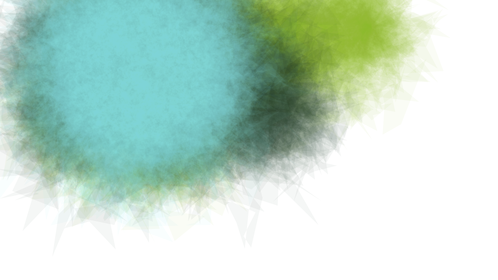

# Watercolor canvas

p5 implementation of [Typer Hobbs generative watercolor simulation](http://www.tylerlhobbs.com/writings/watercolor).

Started with [this](https://github.com/mkontogiannis/p5.js-es6-babel-sass-webpack-boilerplate) boilerplate. 

## Todo:

- Variations in the parameters for each layer. 
- Add different masking for different layer.